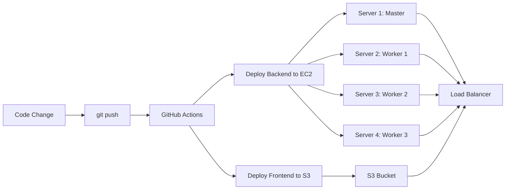

# 🚀 Quick Start - Automated Deployment

## Your Setup is Ready! 

Everything has been configured for your AWS infrastructure:

- **Backend:** 4 EC2 servers (ap-southeast-1)
- **Frontend:** S3 bucket
- **Load Balancer:** Application Load Balancer
- **GitHub Repo:** AkashDavidKumar/Marathon-2026

---

## ⚡ 3-Step Deployment Setup

### Step 1: Configure GitHub Secrets (5 minutes)

Go to: https://github.com/AkashDavidKumar/Marathon-2026/settings/secrets/actions

Add these 7 secrets:

```powershell
# Copy your SSH key
Get-Content "d:\Marathon\Final\aws-migration\debug-marathon-key-v2.pem" | Set-Clipboard
```

| Secret Name | Value |
|-------------|-------|
| `EC2_SSH_KEY` | Paste .pem file contents |
| `MASTER_IP` | `47.130.2.117` |
| `WORKER1_IP` | `13.229.109.204` |
| `WORKER2_IP` | `13.212.253.90` |
| `WORKER3_IP` | `54.169.5.230` |
| `AWS_ACCESS_KEY_ID` | Your AWS access key |
| `AWS_SECRET_ACCESS_KEY` | Your AWS secret key |

📖 **Detailed instructions:** See [GITHUB-SECRETS-SETUP.md](GITHUB-SECRETS-SETUP.md)

---

### Step 2: Push to GitHub

```bash
cd c:\Users\AD41934\Downloads\GlitchFix_Final-main\GlitchFix_Final-main

# Add all files
git add .

# Commit
git commit -m "Setup automated CI/CD deployment"

# Push to GitHub (triggers automatic deployment)
git push origin main
```

---

### Step 3: Watch Deployment

1. Go to: https://github.com/AkashDavidKumar/Marathon-2026/actions
2. Watch the deployment progress in real-time
3. Deployment takes ~5 minutes

---

## 🎯 How It Works

### Before (Manual Deployment):
```
❌ Make code change
❌ SSH into 47.130.2.117 → Upload → Restart
❌ SSH into 13.229.109.204 → Upload → Restart
❌ SSH into 13.212.253.90 → Upload → Restart
❌ SSH into 54.169.5.230 → Upload → Restart
❌ Upload frontend to S3
⏱️ Total: 30-45 minutes
```

### After (Automated):
```
✅ Make code change
✅ git push origin main
✅ ☕ Get coffee
✅ Done!
⏱️ Total: 5 minutes (automated)
```

---

## 📦 What Gets Deployed

Every `git push` to **main** branch triggers:

1. ✅ **Backend** → All 4 EC2 servers
   - Extract to `/opt/debug-marathon`
   - Install Python dependencies
   - Restart via Supervisor
   - Reload Nginx

2. ✅ **Frontend** → S3 bucket
   - Sync to `s3://debug-marathon-assets-052150906633`
   - Delete removed files

3. ✅ **Verification**
   - Check all 4 servers
   - Test Load Balancer health

---

## 🧪 Test Your First Deployment

### 1. Make a Simple Change

Edit any file (e.g., add a comment):

```python
# backend/app.py
# Test CI/CD deployment - timestamp: 2026-02-04
```

### 2. Deploy

```bash
git add .
git commit -m "Test: First automated deployment"
git push origin main
```

### 3. Verify

- **GitHub Actions:** https://github.com/AkashDavidKumar/Marathon-2026/actions
- **Load Balancer:** http://debug-marathon-alb-1798040122.ap-southeast-1.elb.amazonaws.com
- **SSH Check:** 
  ```bash
  ssh -i "d:\Marathon\Final\aws-migration\debug-marathon-key-v2.pem" ubuntu@47.130.2.117 "date"
  ```

---

## 📊 Deployment Workflow



---

## 🛠️ Server Configuration

| Server | IP | Role | Service Manager |
|--------|-----|------|-----------------|
| Master | 47.130.2.117 | Primary Backend | Supervisor + Nginx |
| Worker 1 | 13.229.109.204 | Backend Replica | Supervisor + Nginx |
| Worker 2 | 13.212.253.90 | Backend Replica | Supervisor + Nginx |
| Worker 3 | 54.169.5.230 | Backend Replica | Supervisor + Nginx |

**Deployment Path:** `/opt/debug-marathon`
**Service Name:** `debug-marathon`
**Port:** `5000` (internal, accessed via ALB on port 80)

---

## 🔍 Monitoring & Logs

### GitHub Actions Logs
https://github.com/AkashDavidKumar/Marathon-2026/actions

### Server Logs
```bash
# SSH into any server
ssh -i "d:\Marathon\Final\aws-migration\debug-marathon-key-v2.pem" ubuntu@47.130.2.117

# View application logs
sudo tail -f /var/log/supervisor/debug-marathon.log

# Or use journalctl
sudo journalctl -u debug-marathon -f

# Check service status
sudo supervisorctl status debug-marathon
```

### Load Balancer Health
```bash
curl -I http://debug-marathon-alb-1798040122.ap-southeast-1.elb.amazonaws.com
```

---

## 🚨 Troubleshooting

### Deployment Failed?

1. **Check GitHub Actions logs** for specific error
2. **Verify secrets** are correctly configured
3. **Test SSH connection** manually:
   ```bash
   ssh -i "d:\Marathon\Final\aws-migration\debug-marathon-key-v2.pem" ubuntu@47.130.2.117
   ```

### Service Not Restarting?

```bash
# SSH to server
ssh -i "d:\Marathon\Final\aws-migration\debug-marathon-key-v2.pem" ubuntu@47.130.2.117

# Manually restart
sudo supervisorctl restart debug-marathon
sudo systemctl reload nginx
```

### Changes Not Visible?

- Clear browser cache (Ctrl + Shift + R)
- Check deployment completed successfully in GitHub Actions
- Verify correct branch was pushed

---

## 🎛️ Advanced Usage

### Deploy to Specific Servers Only

Edit [.github/workflows/deploy.yml](.github/workflows/deploy.yml) and comment out unwanted server steps.

### Rollback to Previous Version

```bash
# Find previous commit
git log --oneline

# Revert to previous commit
git revert HEAD

# Push (triggers auto-deployment of old version)
git push origin main
```

### Manual Deployment (Without GitHub)

```bash
# Set environment variables
export MASTER_IP=47.130.2.117
export WORKER1_IP=13.229.109.204
export WORKER2_IP=13.212.253.90
export WORKER3_IP=54.169.5.230
export SSH_KEY="d:/Marathon/Final/aws-migration/debug-marathon-key-v2.pem"

# Run deployment script
bash deploy-multi-server.sh
```

---

## 📈 Next Steps

1. ✅ Configure GitHub Secrets
2. ✅ Test first deployment
3. ✅ Set up monitoring/alerts (CloudWatch)
4. ✅ Configure automated backups
5. ✅ Set up staging environment
6. ✅ Enable HTTPS on ALB

---

## 📞 Quick Reference Commands

```bash
# Test all servers
for ip in 47.130.2.117 13.229.109.204 13.212.253.90 54.169.5.230; do
  echo "Testing $ip..."
  ssh -i "d:\Marathon\Final\aws-migration\debug-marathon-key-v2.pem" ubuntu@$ip "hostname && supervisorctl status debug-marathon"
done

# Deploy changes
git add .
git commit -m "Your change description"
git push origin main

# View live logs
ssh -i "d:\Marathon\Final\aws-migration\debug-marathon-key-v2.pem" ubuntu@47.130.2.117 "sudo tail -f /var/log/supervisor/debug-marathon.log"

# Check S3 bucket
aws s3 ls s3://debug-marathon-assets-052150906633/ --recursive --region ap-southeast-1
```

---

## 📚 Additional Resources

- [GITHUB-SECRETS-SETUP.md](GITHUB-SECRETS-SETUP.md) - Detailed secrets configuration
- [CI-CD-SETUP.md](CI-CD-SETUP.md) - Comprehensive deployment guide
- [.github/workflows/deploy.yml](.github/workflows/deploy.yml) - GitHub Actions workflow
- [deploy-multi-server.sh](deploy-multi-server.sh) - Manual deployment script
- [server-inventory.env](server-inventory.env) - Server configuration

---

**Ready to deploy?** Configure GitHub Secrets and push your code! 🚀

**Questions?** Check the troubleshooting section or GitHub Actions logs.
